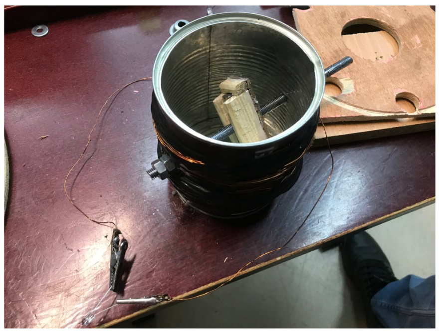

***Table of contents:***
- [Projects](#projects)
  - [Electric generator](#electric-generator)
    - [Description](#description)

# Projects

## Electric generator

### Description

In the secondary school there was an oportunity to participte in 'Young Physicist-Exper' course. It was a great possibility to demonstrate my involvement in the physical sciences. 

My contribution was the development of an alternating current electric generator based on the principle of electromagnetic induction. This project aimed to clearly demonstrate fundamental physical laws. 

**Components of electric generator:**

- Housing
- Insulated wire wound around the housing
- Shaft with a magnet attached to it inside the housing 

_How it was made:_

